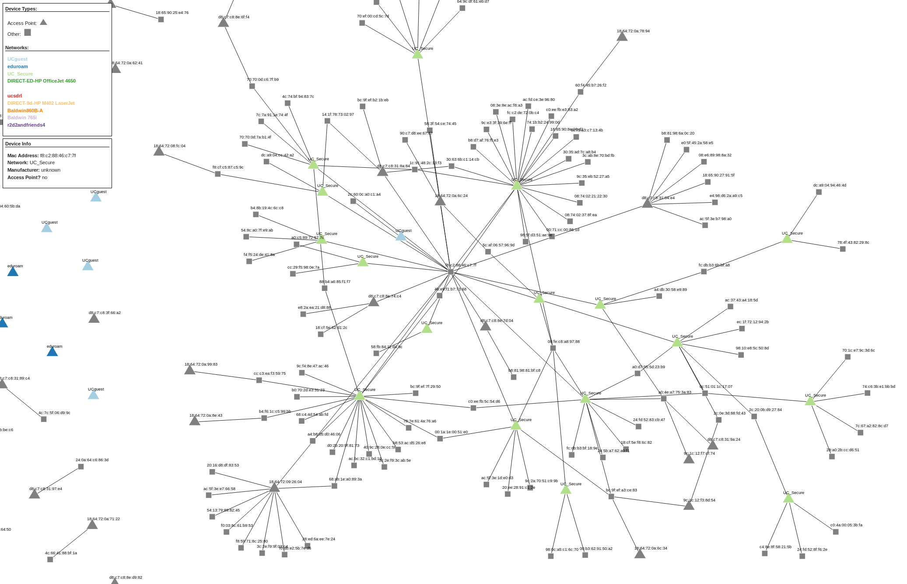

# wifi_map: Map Nearby 802.11 Devices and Networks

wifi_map sniffs nearby 802.11 traffic to build an interactive graph based visualization. It tries to show the nearby networks, access points, wlan devices and how they are all connected.

Traffic is visualized in a local web client (that you run in your browser) using d3.js and is updated live. If you don't have a wireless card that can run in monitor mode wifi_map can also replay network situations from pcaps.

Note that this is just a prototype and it may be buggy. It currently doesn't handle all 802.11 frames or network layouts and it doesn't gather nearly as much information as it could. I do plan to keep working on it and adding new features.

## Setup

**wifi_map has only been tested on Linux (Arch Linux specifically). It should run on macOS but I'm fairly confident it won't run on Windows.**

### Requirements:
* If you want to run it in sniff mode you will need a wireless card that supports monitor mode.
* sqlite3
    * Ubuntu: `sudo apt install sqlite3 libsqlite3-dev`
    * Arch Linux: `sudo pacman -Syu sqlite`
* python3 (won't work with python2)
* pip3
    * Ubuntu: `sudo apt install python3-pip`
    * Arch Linux: `sudo pacman -Syu pip`
* An up to date web browser.

### Installation
1) Clone this repo
2) You'll need all the python packages in the requirements.txt file. I'd recommend installing them in a virtualenv environment so that you don't have to install them globally.

    To install virtualenv:

        sudo pip install virtualenv

    To install wifi_map dependencies:

        cd wifi_map
        virtualenv .env
        source .env/bin/activate
        pip install -r requirements.txt

    If you don't want to use a virtualenv you can just install dependencies with:

        sudo pip install -r requirements.txt

### Running wifi_map

If you used virtualenv to install dependencies make sure you `cd` into the project directory and run:

    source .env/bin/activate

Also if you ever run into issues where the browser client seems to have frozen just try refreshing the page.

#### In sniff mode:

To run in sniff mode you'll need to set up your wireless card in monitor mode using iw or airmon-ng. You'll see more traffic if you run wifi_map while running something like airodump-ng that will do automatic channel switching for you. Running with sudo is required in sniff mode because raw sockets can't be opened without root priveleges. Heres how you run it in sniff mode:

    sudo ./wifi_map/wifi_map.py -i <interface_name>

so for example:

    sudo ./wifi_map/wifi_map.py -i wlp0s6

Now open `http://localhost:6363` in your browser and you should start to see devices show up.

#### In replay mode:

If you don't have a wireless card that supports monitor mode you can still run wifi_map in pcap mode. In pcap mode wifi_map will read 802.11 traffic from a provided pcap file and build a visualization by "replaying" the traffic. There are a few pcap files in the pcap_samples directory that you can use to test it out.

**Note: wifi_map uses scapy to read through pcap files. scapy takes a decent amount of time to process the file before it starts providing packets. The larger the file the longer it takes. This just means that it might take a second before traffic starts showing up in the browser client. Just give it a minute and things should start popping up.**

To run in sniff mode:

    ./wifi_map/wifi_map.py -r pcap_samples/eng-lib-01.cap

Now open `http://localhost:6363`. It may take a minute for devices to start showing up depending on the pcap size.

Once you've got wifi_map open in your browser you can use your mouse to pan, zoom, and move devices around to get a better view.

